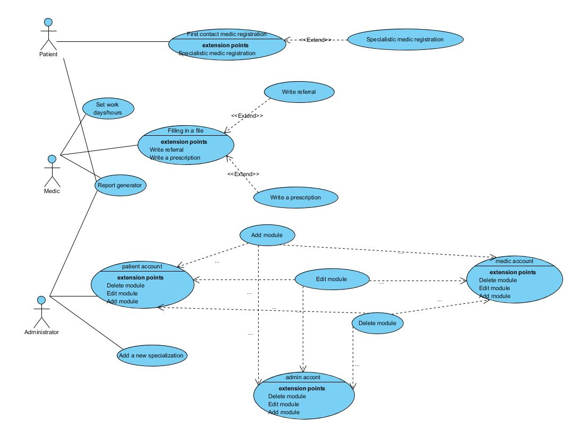

# RegMed
Medical Registration Application, wrote in javaFX

<h1>System specification:</h1>
 <ol>
   <li>Application should have few modules:
     <ul>
       <li><a href="#1">User administration module</a></li>
       <li><a href="#2">Report module</a></li>
       <li><a href="#3">Configuration module</a></li>
     </ul>
   </li>
   <li>Patient have access to Patient module</li>
   <li>Medic have access to Medical module</li>
   <li>Administrator have access to All modules</li>
   <li>Possibility to generate raports</li>
 </ol>    

       
<h2 id="1">User administration module:</h2>
<ul>
    <li>Managing accounts (patient, medic, administrator): Adding, Removing, Editing</li>
    <li>Adding new medical specializations</li>
</ul>       
<h2 id="2">Report module:</h2>
<h4>This module is responsible for creating a pdf files.</h4>
<ul>
    <li>Generating prescriptions -> P</li>
    <li>Generating referral -> P</li>
    <li>Generating patient documentation -> P</li>
    <li>Generating list of patients -> M</li>
    <li>Generating schedule -> M</li>
    <li>Generating logs report -> A</li>
</ul>
<h6>P-patient, M-medic, A-administrator</h6>
<h2 id="3">Configuration module:</h2>
<h4>This module simplifying database configuration.</h4>
<ul>
    <li>DB localization</li>
    <li>Username</li>
    <li>Password</li>
    <li>DB name</li>
</ul>
<h2>UML</h2>
<h3>Use Case Diagram:</h3>

<h1>Target and scope of system:</h1>

System will be used to register patient and keeping his medical documentation like history of health state, diseases and health benefits. During creating account patient must choose his first contact doctor. After create account and log in patient have possibility to choose day and hour of visit to the doctor. 
During the visit doctor filling in the patient file in system, after diagnosis can write and print a prescription or make a referral in a different manner unlock in patient panel possibility to register to Specialist Doctor. Also the doctor can set days and hours of admission. Additionally doctor will have possibility to create list of patients and weekly schedule. 
Only administrator of system have access to add, edit or remove doctors, and create a new specialization.
  
Stakeholders: medical clinics, hospitals and private medical practices.  
Types of reports:

<ul>
    <li>Patient:
        <ul>
            <li>Perscriptions (An instruction written by a medical practitioner that authorizes a patient to be provided a medicine or treatment.)</li>
            <li>Refferals (Referring for consultation, review, or further action.)</li>
            <li>Documentation (Provides official information or evidence or that serves as a record.)</li>
        </ul>
    </li>
    <li>Doctor:
        <ul>
            <li>List of patients (List of people assigned to visit a selected doctor.)</li>
            <li>Schedule (Plan for carrying out a process or procedure, giving lists of intended visit and events.</li>
        </ul>
    </li>
    <li>Administrator:
        <ul>
            <li>Logs report (It's raport with chronological record containing information about events and activities concerning the computer system.</li>
        </ul>
    </li>
</ul>
 

Information in this system will be transmitted and processing only local or using intranet. 
Users permissions:

<ul>
    <li>Patient: Patients using the program can register themselves for an appointment with a selected doctor, have access to the history of their visits to the hospital.</li>
    <li>Doctor: Has the ability to administer visits in his office. The doctor has access to the history of treatment of the patient connected with him.</li>
    <li>Administrator: The administrator has access to the entire database, has full control over the patient's records and data. He can freely change and control visits in the doctor's office. Due to access to sensitive data, the system administrator should be covered by the confidentiality clause.</li>
</ul>

<h2>Hardware requirements:</h2>

System for propertly working need:

<ul>
    <li>Kiosks - will be used by patients for register to doctor, specialist, or for create their account</li>
    <li>PC/laptops - for doctors and administrators, which they will be use for handle their system functionalities</li>
    <li>Printers - will print generated pdf-s.</li>
    <li>Local (internal) network - for proper communication between computers, printers, and different medical clinics if they will be using our system</li>
</ul>
<h2>Unfunctional requirements:</h2>
<ul>
    <li>System must be adapted to the provisions of Polish law</li>
    <li>System must be fully configured and thusready to implementall the required functionalities.</li>
    <li>System must meet the security requirements for user access to system resources through the use of user authentication mechanisms</li>
    <li>System must provide resources protection against unauthorized access from outside and inside the system</li>
    <li>System should be scalable</li>
    <li>System must provide mechanisms for granting access rights, enabling selected users to selectively access information</li>
    <li>System must have a Polish language interface of the user</li>
    <li>System must function in accordance with the teleinformatic network of the clinic</li>
    <li>System must be comprehensive, it must perform all the functions and activities required by the Employer</li>
</ul>
